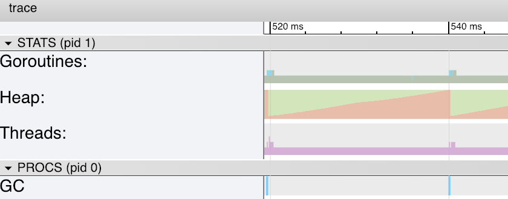
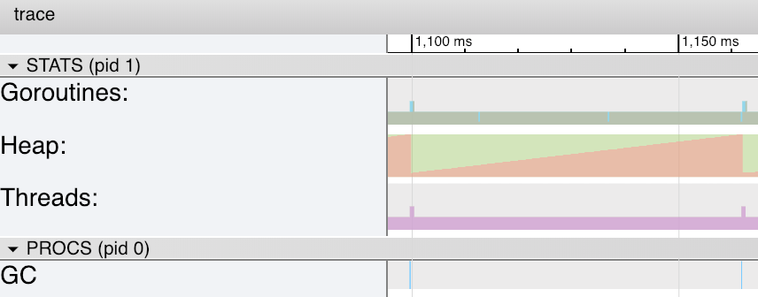
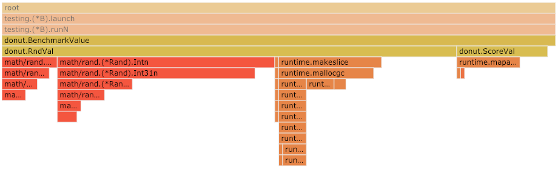
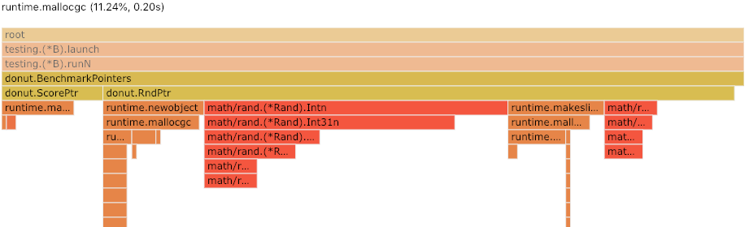

# <!-- fit --> Summoning the Go Memory Manager

<!-- _class: lead -->

## Mario Macías, Ph.D.
### Barcelona Golang Meetup. Jan 31st, 2019

#### twitter.com/MaciasUPC &nbsp;&nbsp;&nbsp;&nbsp;&nbsp;&nbsp;&nbsp;&nbsp;&nbsp; github.com/mariomac

# Who am I?

## Senior Software Engineer at New Relic (2017-)
## Part-time associate lecturer at Universitat Politècnica de Catalunya (2009-)

### Before:
```plain
 |       |Game|                                        |Mido|  New 
 | iSOCO |loft|    Barcelona Supercomputing Center     |kura| Relic 
 |---+---+---+---+---+---+---|---+---+---+---+---+---+---+---+---*-
2003    2005                2010                2015            2019
```

# Our scenario: Donuts quality scoring

```go
package donut

type Donut struct {              type Preferences struct {
    Radius     float32               Radius     float32      
    Thick      float32               Thick      float32    
    Toppings   []string              Toppings   map[string]float32      
    GlutenFree bool                  GlutenFree float32              
    Hole       bool                  Hole       float32
    Filling    string                Filling    map[string]float32
}                                 }
```

# Our scenario: Donuts quality scoring

```plain
+-------------+         +-------------+
|   d:Donut   +-------->+             |
+-------------+         |             |       +-----+
                        | Score(d, p) +------>+score|
+-------------+         |             |       +-----+
|p:Preferences+-------->+             |
+-------------+         +-------------+
```

Our monopolistic Cloud service needs to monitor all the Donuts in the Earth!
**Performance is critical**

# Designing our functions

```go
func Generate() *Donut { }
func Score(d *Donut, p *Preferences) float32 { }
```
... or ...
```
func Generate() Donut { }
func Score(d Donut, p Preferences) float32 { }
```
... ?

# Remembering good old C-lessons

> When passing arguments or returning values, **pointers are faster than big structs**

### `reflect.TypeOf`, Go 1.11.5 for Darwin x86_64

| |Value|Pointer|
|-:|:-:|:-:|
|Donut| 56 bytes | 8 bytes |
|Preferences| 32 bytes | 8 bytes |

# Checking that our previous knowledge is true

```go
func BenchmarkValue(b *testing.B) {
	preferences := RndPreferences()
	for i := 0; i < b.N; i++ {
		_ = ScoreVal(GenerateRndVal(), preferences)
	}
}
func BenchmarkPointers(b *testing.B) {
	preferences := RndPreferences()
	for i := 0; i < b.N; i++ {
		_ = ScorePtr(GenerateRndPtr(), &preferences)
	}
}
```

# Benchmark Results

`go test ./donut/. -bench=Benchmark  -benchmem`

```
BenchmarkValue-4     5000000     262 ns/op    15 B/op   0 allocs/op
BenchmarkPointers-4  5000000     332 ns/op    79 B/op   1 allocs/op
```

Our code (including random number generation and scoring operations) using values is ~23% faster than using pointers!

# Digging into the results

1. Adding `-cpuprofile profile.out` to the `go test` command.
2. Running `go tool trace benchmarks.out`

# Traces using pointers



* Heap is filled every ~20 ms
* Garbage Collection usually takes ~240 ns

# Traces using values



* Heap is filled every ~60ms
* Garbage Collection usually takes ~240 ns

# Digging more into the results

1. Adding `-cpuprofile cpu.prof -memprofile mem.prof` to the `go test` command.
2. Running `go tool pprof`

# Flame graph for value-based benchmark

`go tool pprof cpu.prof`



# Flame graph for pointer-based benchmark

`go tool pprof cpu.prof`


# `top` Memory generation for both benchmarks

`go tool pprof mem.prof`
```plain
(pprof) top
Showing nodes accounting for 568.03MB, 100% of 568.03MB total
      flat  flat%   sum%        cum   cum%
  479.03MB 84.33% 84.33%   479.03MB 84.33%  github.com/mariomac/gomem/donut.GenerateRndPtr
      89MB 15.67%   100%       89MB 15.67%  github.com/mariomac/gomem/donut.GenerateRndVal
         0     0%   100%   479.03MB 84.33%  github.com/mariomac/gomem/donut.BenchmarkPointers
         0     0%   100%       89MB 15.67%  github.com/mariomac/gomem/donut.BenchmarkValue
         0     0%   100%   568.03MB   100%  testing.(*B).launch
         0     0%   100%   568.03MB   100%  testing.(*B).runN
```

# But `GenerateRndPtr` and `GenerateRndVal` generate the same amount of information!


# Compile-time escape analysis

#### <!-- fit --> **Priority #1**: try to allocate new objects in the stack

# Compile-time escape analysis

#### <!-- fit --> **Priority #1**: try to allocate new objects in the stack
#### <!-- fit --> **#2**: allocate in the heap the values that "escape" the stack

# What do _"to escape"_ means?

```plain
                                    
func a() *Obj {
  r := Obj{}                     
  // ... do something        
  return &r;                     
}                            
func b() {                       
  o := a()
  // ... do something
}
```
# What do _"to escape"_ means?

```plain
                                    Stack
func a() *Obj {
  r := Obj{}                     +----------+
  // ... do something        b() |  o:*Obj  |
  return &r;                     +----------+
}                            
func b() {                       
  o := a()
  // ... do something
}
```
# What do _"to escape"_ means?

```plain
                                    Stack
func a() *Obj {
  r := Obj{}                     +----------+
  // ... do something        b() |  o:*Obj  |
  return &r;                     +----------+
}                            a() |  r:Obj   |
func b() {                       +----------+
  o := a()
  // ... do something
}
```
# What do _"to escape"_ means?

```plain
                                    Stack
func a() *Obj {
  r := Obj{}                     +----------+
  // ... do something        b() |  o:*Obj -----+
  return &r;                     +----------|   |
}                            a() |  r:Obj <-----+
func b() {                       +----------+
  o := a()
  // ... do something
}
```
# What do _"to escape"_ means?

```plain
                                    Stack
func a() *Obj {
  r := Obj{}                     +----------+
  // ... do something        b() |  o:*Obj -----+
  return &r;                     +----------+   |
}                                         <-----+
func b() {                       
  o := a()
  // ... do something
}
```

## <!-- _color: red --> Unsafe memory access!!

# Object creation is _escaped_ to the heap

```plain
                                    Stack             Heap
func a() *Obj {
  r := Obj{}                     +----------+        +----------+
  // ... do something        b() |  o:*Obj ------------> r:Obj  |
  return &r;                     +----------+        +----------+
}                            
func b() {                       
  o := a()
  // ... do something
}
```

# Getting insights from the go compiler

* Add `-gcflags="-m"` to the `go build`, `go test` or `go run` commands.

```go
 5: func a() *Obj {           | ./dummy.go:5:6: can inline a
 6:   r := Obj{}              | ./dummy.go:10:8: inlining call to a
 7:   return &r               | ./dummy.go:7:9: &r escapes to heap
 8: }                         | ./dummy.go:6:2: moved to heap: r
 9: func b() {                | ./dummy.go:11:13: o escapes to heap
10:   o := a()                | ./dummy.go:10:8: &r escapes to heap
11:   fmt.Printf("%#v\n", o)  | ./dummy.go:10:8: moved to heap: r
12: }                         | ./dummy.go:11:12: b ... argument
13: func main() {             |                   does not escape
14:   b()
15: }
```

# Getting insights from the go compiler

* Using `-gcflags="-m"` to improve the efficiency of our code.

```go
 5: func a() Obj {            | ./dumm2.go:5:6: can inline a 
 6:   r := Obj{}              | ./dumm2.go:12:8: inlining call to a
 7:   return r                | ./dumm2.go:11:13: o escapes to heap
 8: }                         | ./dumm2.go:11:12: b ... argument
 9: func b() {                |                   does not escape
10:   o := a()
11:   fmt.Printf("%#v\n", o)
12: }
13: func main() {
14:   b()
15: }
```

# Compile-time escape analysis

#### <!-- fit --> **Priority #1**: try to allocate new objects in the stack
#### <!-- fit --> **#2**: allocate in the heap the values that "escape" the stack
* Even if they don't actually escape, **they will be allocated in the heap if the compiler is not 100% sure**

# <!--fit--> Conclusions

# #1: putting some light on a common misconception for memory-managed languages

## _"Moving pointers is faster than moving structs"_

# #1: putting some light on a common misconception for memory-managed languages

## _"Moving pointers is faster than moving structs"_
### Yes, but... `t(heap_alloc) >> t(cache_line_copy)`

# #2: <!--fit--> Don't try premature optimizations
  - Readability first
  - Compiler optimizations may disable your "optimizations"
  - Internal implementation details may disable compiler optimizations: `log.Debug(value)`

# #3: walktrhough by some nice Go performance tools 

* `-benchmem` to also benchmark memory generation
* `-cpuprofile` (and `-memprofile`) to trace garbage collection (amongst others)
* `pprof` to see which parts of the code are the most time/memory consuming
* `-gcflags="-m"` to get insights about compiler optimization decisions

# Future work

- Values travelling depth in the call stack
  - Recursive functions
- Cost of Stack growth vs big heaps
- Using values vs pointers as receivers

# <!-- fit --> Thank you for your attention!

<!-- _class: lead -->

## Mario Macías, Ph.D.
### Barcelona Golang Meetup. Jan 31st, 2019

#### twitter.com/MaciasUPC &nbsp;&nbsp;&nbsp;&nbsp;&nbsp;&nbsp;&nbsp;&nbsp;&nbsp; github.com/mariomac